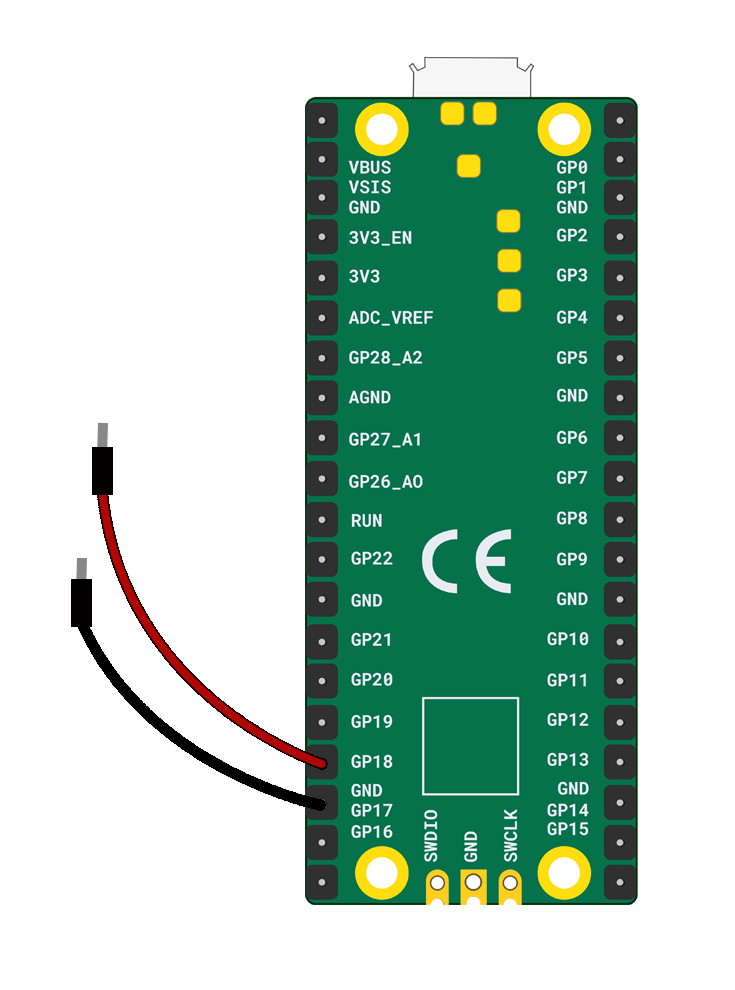

Tu auras besoin de :

+ Un Raspberry Pi Pico
+ Deux fils de connexion mâle-femelle

Attache un fil de connexion au **GP18** et attache l'autre fil de connexion au **GND** le plus proche.

**Tip:** When you craft a switch you will stick the pin end of the jumper wire to a conductive surface, like copper tape or kitchen foil. 
