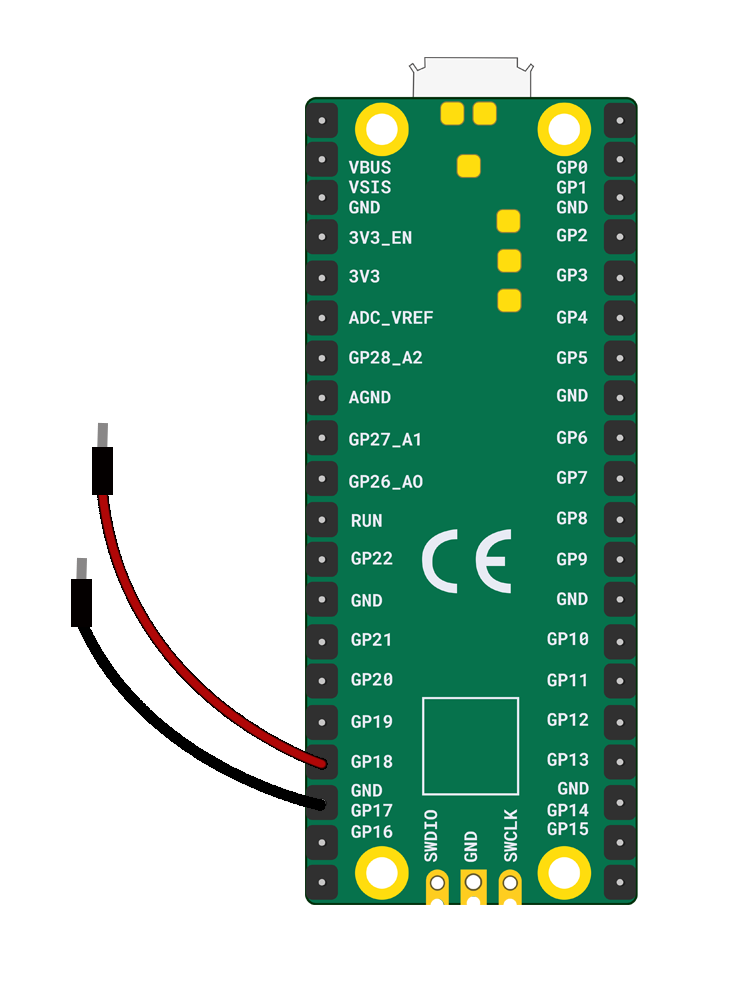

Je hebt nodig:

+ Een Raspberry Pi Pico
+ 2 verbindingsdraden met pin-bus aansluiting

Bevestig een pin-bus verbindingsdraad aan **GP18** en bevestig de andere pin-bus verbindingsdraad aan de **GND** die er het dichtst bij is.

**Tip:** Als je zelf een schakelaar maakt plak je de pin van de verbindingsdraad het beste vast op een geleidend oppervlak, zoals kopertape of aluminiumfolie.

***
Dit project werd vertaald door vrijwilligers:

[name]

[name]

[name]

Dankzij vrijwilligers kunnen we mensen over de hele wereld de kans geven om in hun eigen taal te leren. Jij kunt ons helpen meer mensen te bereiken door vrijwillig te starten met vertalen - meer informatie op [rpf.io/translate](https://rpf.io/translate).
